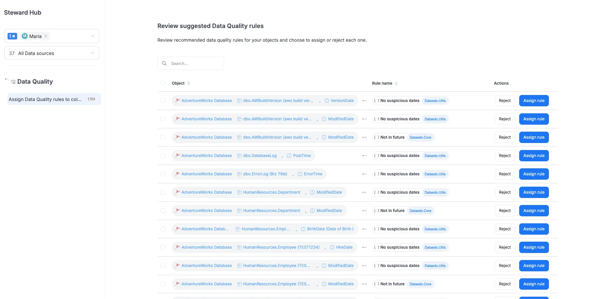

# Suggested Data Quality Rules

Po wejściu w szczegóły kolumny, w zakładce Data Quality, użytkownicy mogą zobaczyć sugerowane reguły, które nasz system proponuje automatycznie – na podstawie nazw kolumn i ich dopasowania do znanych wzorców.

wyjaśnia użytkownikowi, czym są te sugestie i skąd się biorą,

Żeby to zrobić...

Dodatkowo mamy też miejsce, w którym możemy zobaczyć zbiorcze sugestie reguł dla wszystkich obiektów:

Znajdziesz je wchodząc w Data Governance → Data Quality, a następnie klikając zakładkę Suggestions

## Examples

pokazuje kilka przykładów typowych kolumn i reguł, które mogą się pojawić jako sugestie,

<table>
  <thead>
    <tr>
      <th>Category</th>
      <th>Column Name Contains</th>
      <th>Suggested Rules</th>
    </tr>
  </thead>
  <tbody>
    <tr>
      <td>📧 Email</td>
      <td><code>%mail%</code></td>
      <td>Valid email address</td>
    </tr>
    <tr>
      <td>🪪 Government IDs</td>
      <td><code>%ssn%</code>, <code>%nip%</code>, <code>%pesel%</code>, <code>%ein%</code></td>
      <td>
        <ul>
          <li>ssn → Valid US SSN</li>
          <li>nip → Valid Polish NIP</li>
          <li>pesel → Valid Polish PESEL</li>
          <li>ein → Valid US EIN</li>
        </ul>
      </td>
    </tr>
    <tr>
      <td>📅 Dates</td>
      <td><code>created_at</code>, <code>updated_at</code>, <code>timestamp</code>, <code>expiry_date</code></td>
      <td>
        <ul>
          <li>Future dates exist (e.g., <code>%expirydate%</code>)</li>
          <li>Not in future (e.g., <code>%createdat%</code>, <code>%modifiedat%</code>)</li>
          <li>Is fresh (e.g., <code>%lastupdated%</code>)</li>
          <li>No suspicious dates (for all dates)</li>
        </ul>
      </td>
    </tr>
    <tr>
      <td>🌐 URLs and IPs</td>
      <td><code>url</code>, <code>website</code>, <code>link</code>, <code>ip_address</code></td>
      <td>
        <ul>
          <li>Valid HTTP address</li>
          <li>Valid IPv4 address</li>
        </ul>
      </td>
    </tr>
    <tr>
      <td>🌍 Postal Codes</td>
      <td><code>zip_code</code></td>
      <td>Valid US zip code (depends on country)</td>
    </tr>
    <tr>
      <td>🔢 Identifiers and Product Codes</td>
      <td><code>asin</code>, <code>iban</code>, <code>imei</code>, <code>vin</code>, <code>cusip</code>, <code>duns</code></td>
      <td>
        <ul>
          <li>asin → Valid ASIN</li>
          <li>iban → Valid IBAN</li>
          <li>imei → Valid IMEI</li>
          <li>vin → Valid VIN</li>
          <li>cusip → Valid CUSIP</li>
        </ul>
      </td>
    </tr>
    <tr>
      <td>🧾 JSON or Metadata</td>
      <td><code>%json%</code>, <code>%payload%</code></td>
      <td>Valid JSON</td>
    </tr>
  </tbody>
</table>

| Category                    | Column Name(s)                                      | Suggested Rules                                        |
|----------------------------|-----------------------------------------------------|--------------------------------------------------------|
| **Email**                  | `%mail%`                                            | Valid email address                                    |
| **Government IDs**         | `%ssn%`, `%nip%`, `%pesel%`, `%ein%`                | - `ssn`, `%_ssn`, `%ssn%` → Valid US SSN              |
|                            |                                                     | - `nip`, `%nip%`, `nip%` → Valid Polish NIP           |
|                            |                                                     | - `pesel` → Valid Polish PESEL                        |
|                            |                                                     | - `ein` → Valid US EIN                                |
| **Dates**                  | `created_at`, `updated_at`, `timestamp`, `expiry_date` | - Future dates exist (e.g. `%expiry%date%`)       |
|                            |                                                     | - Not in future (e.g. `%created%at%`, `%modified%at%`)|
|                            |                                                     | - Is fresh (e.g. `%last%updated%`)                    |
|                            |                                                     | - No suspicious dates                                 |
| **URLs and IPs**           | `url`, `website`, `link`, `ip_address`              | - Valid HTTP address                                  |
|                            |                                                     | - Valid IPv4 address (for IPs)                        |
| **Postal Codes**           | `zip_code`                                          | Valid US zip code (depends on country)                |
| **Identifiers and Product Codes** | `asin`, `iban`, `imei`, `vin`, `cusip`, `duns` | - `asin` → Valid ASIN                            |
|                            |                                                     | - `iban` → Valid IBAN                                 |
|                            |                                                     | - `imei` → Valid IMEI                                 |
|                            |                                                     | - `vin` → Valid VIN                                   |
|                            |                                                     | - `cusip` → Valid CUSIP                               |
| **JSON or Metadata**       | `%json%`, `%payload%`                               | Valid JSON                                             |

| Category                     | Column Name Contains                                | Suggested Rules                                                                                                                                 |
|-----------------------------|------------------------------------------------------|--------------------------------------------------------------------------------------------------------------------------------------------------|
| 📧 Email                    | `%mail%`                                             | Valid email address                                                                                                                              |
| 🪪 Government IDs           | `%ssn%`, `%nip%`, `%pesel%`, `%ein%`                | - ssn → Valid US SSN - nip → Valid Polish NIP - pesel → Valid Polish PESEL - ein → Valid US EIN                                  |
| 📅 Dates                    | `created_at`, `updated_at`, `timestamp`, `expiry_date` | - Future dates exist (e.g., `%expirydate%`) - Not in future (e.g., `%createdat%`, `%modifiedat%`) - Is fresh (`%lastupdated%`) - No suspicious dates |
| 🌐 URLs and IPs             | `url`, `website`, `link`, `ip_address`              | - Valid HTTP address - Valid IPv4 address                                                                                                   |
| 🌍 Postal Codes             | `zip_code`                                           | Valid US zip code (depends on country)                                                                                                           |
| 🔢 Identifiers & Product Codes | `asin`, `iban`, `imei`, `vin`, `cusip`, `duns`       | - asin → Valid ASIN - iban → Valid IBAN - imei → Valid IMEI - vin → Valid VIN - cusip → Valid CUSIP                         |
| 🧾 JSON or Metadata         | `%json%`, `%payload%`                                | Valid JSON                                                                                                                                       |

:::info
Nie wszystkie kolumny mają dostępne sugestie – ale w wielu przypadkach będą one przyspieszały ten manualny proces. 
:::

  <strong>Info:</strong> Nie wszystkie kolumny mają dostępne sugestie – ale w wielu przypadkach będą one przyspieszały ten manualny proces.

