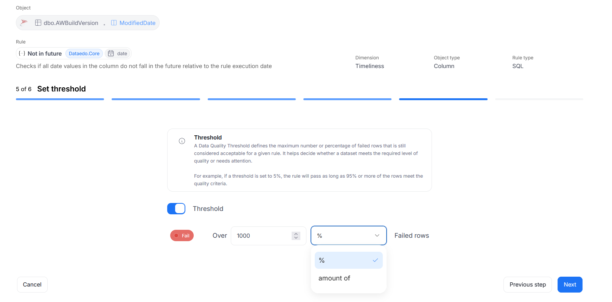
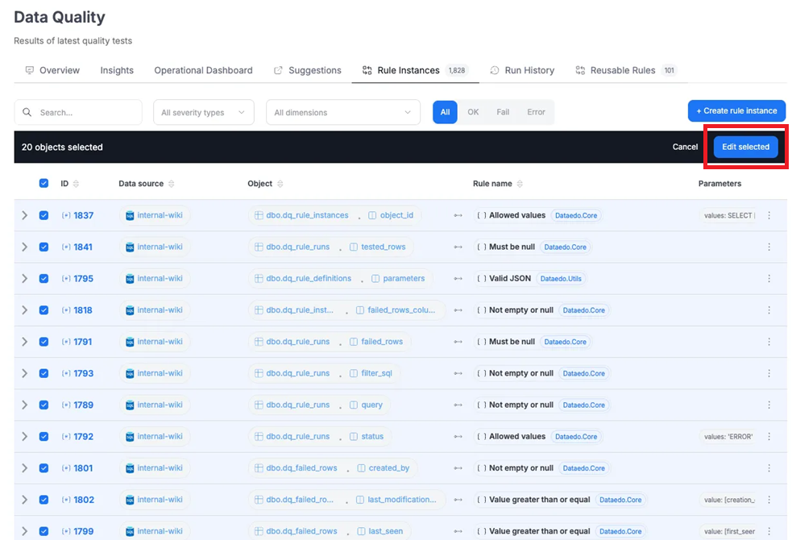
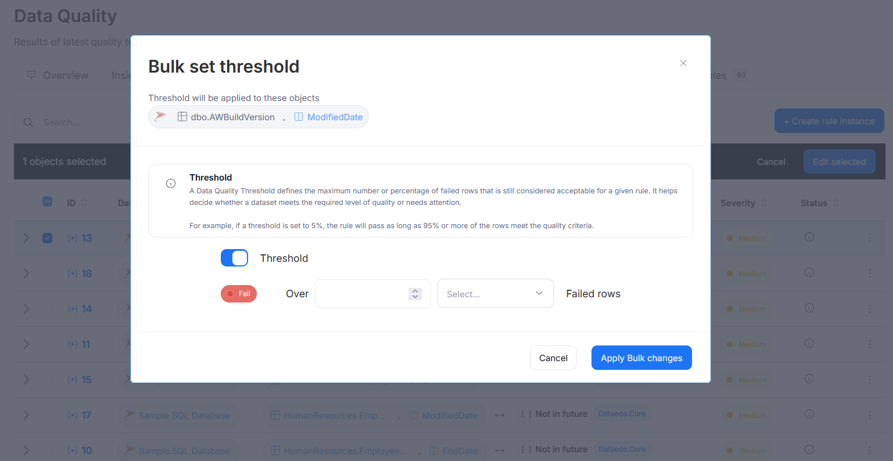

# Step 4: Set Threshold

Domyślnie instancje reguł Data Quality dostają status *fail*, jeśli chociaż jeden wiersz nie spełnia warunków reguły. W niektórych przypadkach może to być zbyt restrykcyjne – użytkownicy mogą chcieć dopuścić niewielki margines błędu, np. uznać, że dopóki mniej niż 5% wierszy jest niepoprawnych, wszystko jest w porządku.

Dlatego dodaliśmy możliwość ustawienia własnego progu (thresholdu), który decyduje, kiedy instancja powinna dostać status *fail*, a kiedy *ok.*

Na etapie tworzenia instancji reguły użytkownik może zdecydować, czy chce ustawić threshold – czyli określić, ile błędnych wierszy możesz dopuścić, zanim instancja zostanie oznaczona jako *fail*.

Domyślnie próg nie jest ustawiony, co oznacza, że reguła działa tak jak dotychczas – nawet jeden niepoprawny wiersz powoduje, że cała instancja dostaje status *fail*.

Jeśli jednak użytkownik chce dopuścić pewien margines błędu, to może włączyć opcję ustawiania thresholdu za pomocą przełącznika. Po jej aktywowaniu ma do wyboru dwie możliwości:

Procentowy próg – instancja dostanie status fail, jeśli liczba błędnych wierszy przekroczy podany procent (np. 5%).

Liczbowy próg – instancja dostanie status fail, jeśli liczba błędnych wierszy przekroczy określoną liczbę (np. 100 wierszy).

Ustawiony threshold można w każdej chwili edytować po zapisaniu instancji. Można też ustawić go masowo dla wielu instancji jednocześnie – co jest szczególnie przydatne w przypadku już istniejących reguł, tak aby użytkownicy nie musieli edytować każdej z osobna. Po zaznaczeniu wielu instancji i kliknięciu Edit selected można ustawić go masowo.

