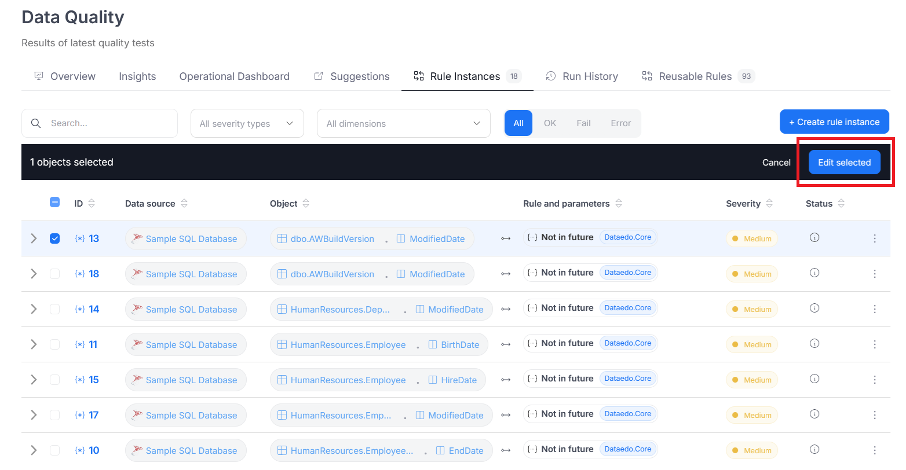

# Step 4: Set Threshold

Domyślnie, Data Quality rule instances dostają status *fail*, jeśli chociaż jeden wiersz nie spełnia warunków reguły. W niektórych przypadkach może to być zbyt restrykcyjne – użytkownicy mogą chcieć dopuścić niewielki margines błędu, np. uznać, że dopóki mniej niż 5% wierszy jest niepoprawnych, wszystko jest w porządku. Dlatego in the **Set Threshold** step,  użytkownik może ustawić własny progu, który określa, ile błędnych wierszy możesz dopuścić, zanim instancja zostanie oznaczona jako *fail*.

:::info
Domyślnie próg nie jest ustawiony, co oznacza, że reguła działa tak jak dotychczas–nawet jeden niepoprawny wiersz powoduje, że cała instancja dostaje status *fail*.
:::

If you want to dopuścić pewien margines błędu, to może włączyć opcję ustawiania thresholdu za pomocą przełącznika. Po jej aktywowaniu ma do wyboru dwie możliwości:

- **Procentowy próg**: instancja will fail, jeśli liczba błędnych wierszy przekroczy podany procent (np. 5%).

- **Liczbowy próg**: instancja will fail, jeśli liczba błędnych wierszy przekroczy określoną liczbę (np. 100 wierszy).

Ustawiony threshold można w każdej chwili edytować po zapisaniu instancji. Można też ustawić go masowo dla wielu instancji jednocześnie – co jest szczególnie przydatne w przypadku już istniejących reguł, tak aby użytkownicy nie musieli edytować każdej z osobna. By to zrobić, po zaznaczeniu wielu instancji i kliknięciu Edit selected.

A window will open where you can...

A Data Quality Threshold defines the maximum number or percentage of failed rows that is still considered acceptable for a given rule. It helps decide whether a dataset meets the required level of quality or needs attention.

For example, if a threshold is set to 5%, the rule will pass as long as 95% or more of the rows meet the quality criteria.